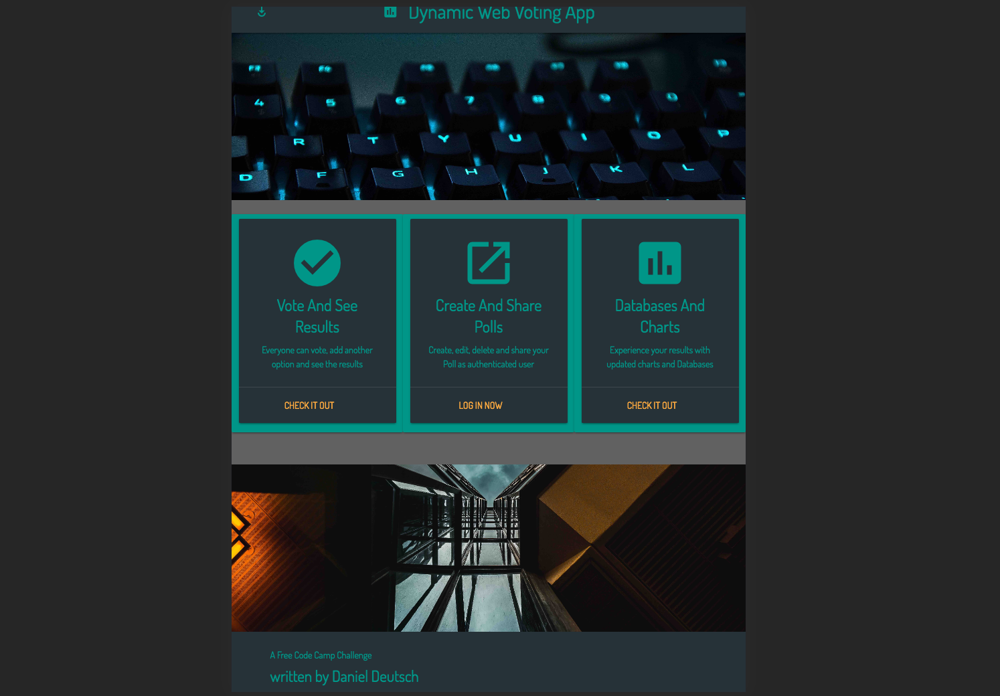

## 📝 Author

##### Daniel Deutsch <kbd>[Createdd.com](http://createdd.com/) / [Github](https://www.freecodecamp.com/ddcreationstudios) / [LinkedIn](https://www.linkedin.com/in/daniel-deutsch-b95611127) / [CodePen](http://codepen.io/ddcreationstudios/)  / [Medium](https://medium.com/@ddcreationstudi) / [Hashnode](https://hashnode.com/@DDCreationStudio) / [E-Mail](mailto:dd@createdd.com)</kbd>

### FreeCodeCamp Dynamic Web Application Projects:
# Build A Voting App 
   

<!---  -->

## See live on Heroku

(Keep in mind that I am using the free tier version on Heroku, which can shut down when traffic is too high in a certain time period)

 
<a href="https://ddcs-votingapp.herokuapp.com/">https://ddcs-votingapp.herokuapp.com/ </a>

## Built with the MERN stack 

|MongoDB|Express|React|NodeJS|
|--|--|--|--|
|||||
|a free and open-source cross-platform document-oriented database program|Fast, unopinionated, minimalist web framework for node.|a JavaScript library for building user interfaces|a JavaScript runtime built on Chrome's V8 JavaScript engine|

 

  

  <h3 align="center">MaterializeCSS</h3>
  

     a CSS Framework based on material design.

## Photo credit

<a href="https://unsplash.com">Unsplash.com</a>

## User stories:

- [X] As an authenticated user, I can keep my polls and come back later to access them.
- [X] As an authenticated user, I can share my polls with my friends.
- [X] As an authenticated user, I can see the aggregate results of my polls.
- [X] As an authenticated user, I can delete polls that I decide I don't want anymore.
- [X] As an authenticated user, I can create a poll with any number of possible items.
- [X] As an unauthenticated or authenticated user, I can see and vote on everyone's polls.
- [X] As an unauthenticated or authenticated user, I can see the results of polls in chart form. (This could be implemented using Chart.js or Google Charts.)
- [X] As an authenticated user, if I don't like the options on a poll, I can create a new option.

## A FreeCodeCamp Challenge

<a href="https://www.freecodecamp.org/challenges/build-a-voting-app">Build a Voting App</a>

## Issues / Bugs / Further features 

There are already issues open! Feel free to add feedback: 

## Frameworks / Libraries

| **Name** | **Description** |**Used**|
|----------|-------|---|
|  [React](https://facebook.github.io/react/)  |   Fast, composable client-side components.    | Frontend |
|  [Redux](http://redux.js.org) |  Enforces unidirectional data flows and immutable, hot reloadable store. Supports time-travel debugging. | Frontend |
|  [React Router](https://github.com/reactjs/react-router) | A complete routing library for React | Frontend |  Compiles ES6 to ES5. Enjoy the new version of JavaScript today.     | Frontend |
| [React Google Charts](https://github.com/RakanNimer/react-google-charts) | A React Google Charts Wrapper | Frontend |
| [Axios](https://github.com/mzabriskie/axios) | Promise based HTTP client for the browser and node.js | Frontend |
| [MaterializeCSS](http://materializecss.com/) | A a CSS Framework based on material design. | Frontend |
| [Express](https://github.com/expressjs/express) | For creating the backend logic | Backend |
| [Mongoose](https://github.com/Automattic/mongoose) | To work faster with MongoDB | Backend |
| [Passport](http://passportjs.org/) | For simplified authentication in Node.js | Backend |
| [Babel](https://github.com/babel/babel) | Compiles ES6 into ES5 | General |
| [Webpack](http://webpack.github.io) | Bundles npm packages and our JS into a single file. | General |  
| [ESLint](http://eslint.org/)| Lint JS. Reports syntax and style issues. | General |

  
